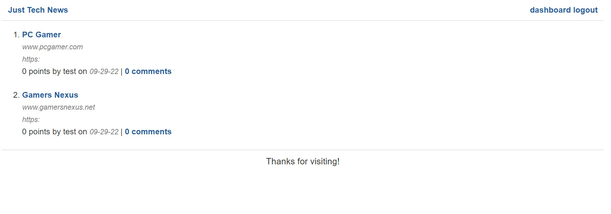

# Tech News Java API

  # Description
  
  A tech news blog API built on Java front and back-end frameworks. This project is mainly focused on building the back-end and API to handle CRUD requests using Java. You create an account to post links to various tech sites for which people can make comments on the post made, all posts appear on the homepage. This project uses the MVC layout with Spring Boot for the back-end, MySQL for the database and, Thymeleaf for the front-end. 

  # Table of Contents
  
  - [Installation](#installation)
  - [Usage](#usage)
  
  - [Deployed App](#deployed-app)
  - [Tests](#tests)
  - [Questions](#questions)

  # Installation
  
  Java 17 LTS for the SDK. 
  Database: MySQL.
  Front-end Frameworks and Dependencies:  
  - Thymeleaf
  - Thymeleaf Layout Dialect

  Back-end Frameworks and Dependencies:  
  - Spring Boot  
  - Spring Data JPA  
  - Spring Session  
  - Spring Security Core
  - MySQL Driver
  - BCrypt

  # Usage
  
    

  # Deployed App  

  Link to deployed app on Heroku: https://rocky-waters-09134.herokuapp.com/
  

  # Tests
    
    None written.

  # Questions
  
  You can find my GitHub profile at: https://github.com/r134x7

  If you have any questions, you can contact me by email: r134x7@gmx.com

